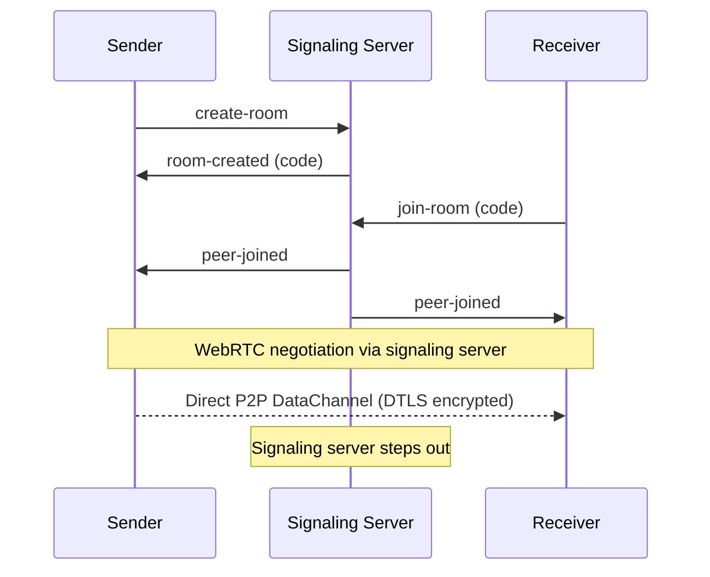

# DropPeer
> Secure, peer-to-peer file transfer from your terminal.

DropPeer transfers files directly between two machines using WebRTC DataChannels.
No cloud storage, no file size limits, no third-party servers involved in the actual transfer.
Files are encrypted in transit via DTLS and verified with SHA-256 checksums.

## How it works

1. A lightweight signaling server helps two peers find each other
2. Once connected, files stream directly between machines via WebRTC
3. The signaling server steps out — it never sees your file data

## Prerequisites

- Go 1.21 or higher
- Both machines must be able to reach the signaling server

## Installation

```bash
git clone https://github.com/ayush-void/droppeer.git
cd droppeer
go build -o droppeer ./cmd/droppeer
```

## Usage

**Step 1 — Start the signaling server** (on any reachable machine):
```bash
./droppeer serve
```

**Step 2 — Send a file:**
```bash
./droppeer send --file=photo.jpg
# Prints a 6-character room code, e.g. "AB3X9F"
```

**Step 3 — Receive the file** (on another machine):
```bash
./droppeer receive --code=AB3X9F
# File saved as received_photo.jpg
```
## Architecture


|---|---|---|
| Signaling server | `internal/signaling/` | Room management, SDP/ICE relay |
| Sender | `internal/transfer/sender.go` | File chunking, DataChannel creation |
| Receiver | `internal/transfer/receiver.go` | File reconstruction, checksum verification |

## Security

- **Encryption** — all data is encrypted via WebRTC's built-in DTLS protocol
- **Integrity** — SHA-256 checksum verified after every transfer
- **Privacy** — file data never passes through the signaling server

